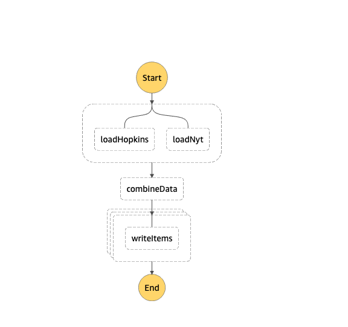

# ETL with step functions

Funzies with step functions. Doing some ETL work.

This stack will deploy a state machine which looks as follows

The _load_ stuff pulls data about COVID from NYT and Hopkins sites. Next step merges them together (enriching the NYT one). After that we are writing all the results into DDB.

I definitely learned a lot about Node.js streams in this one
